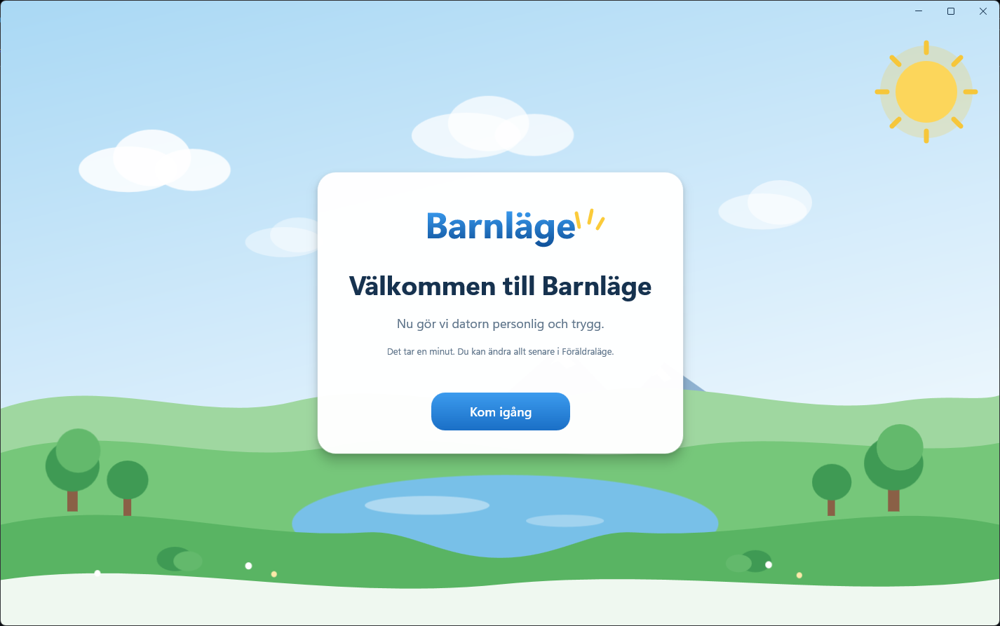
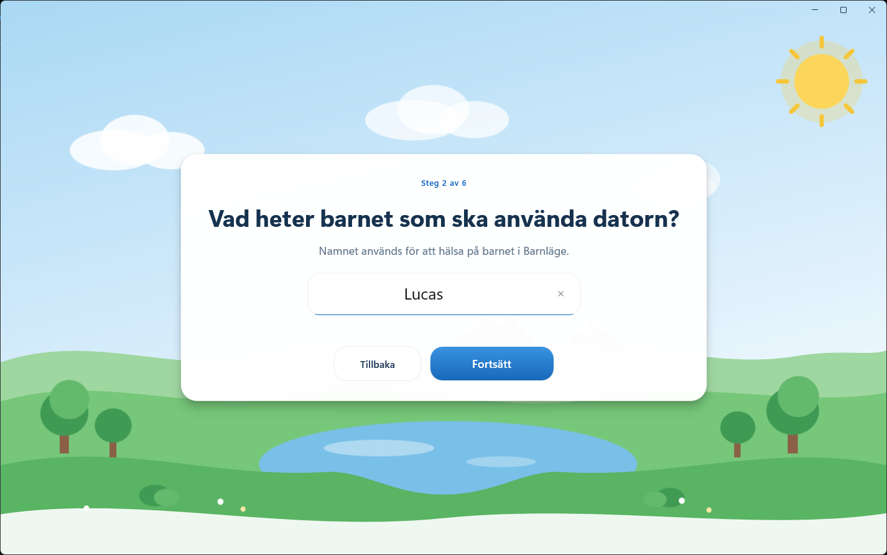
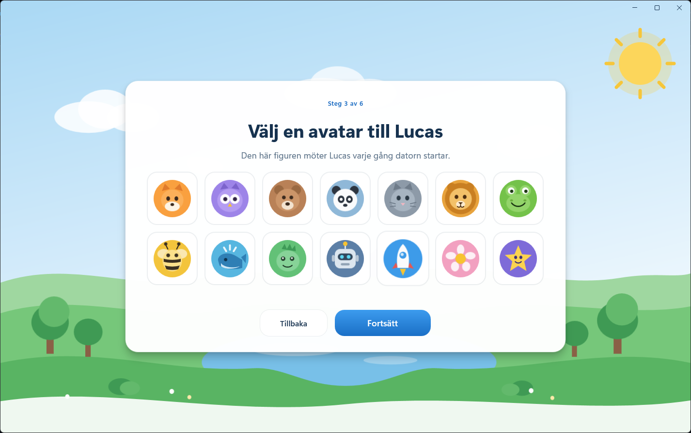
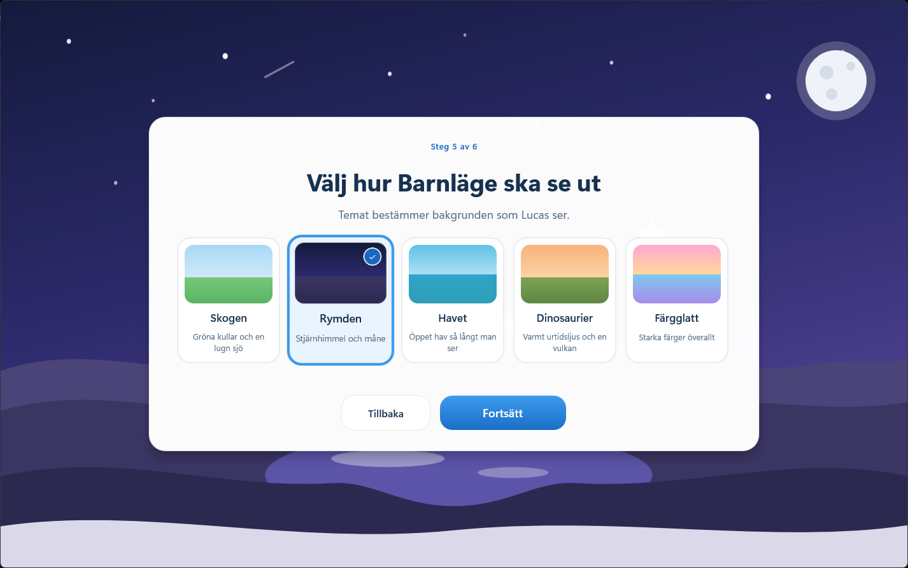
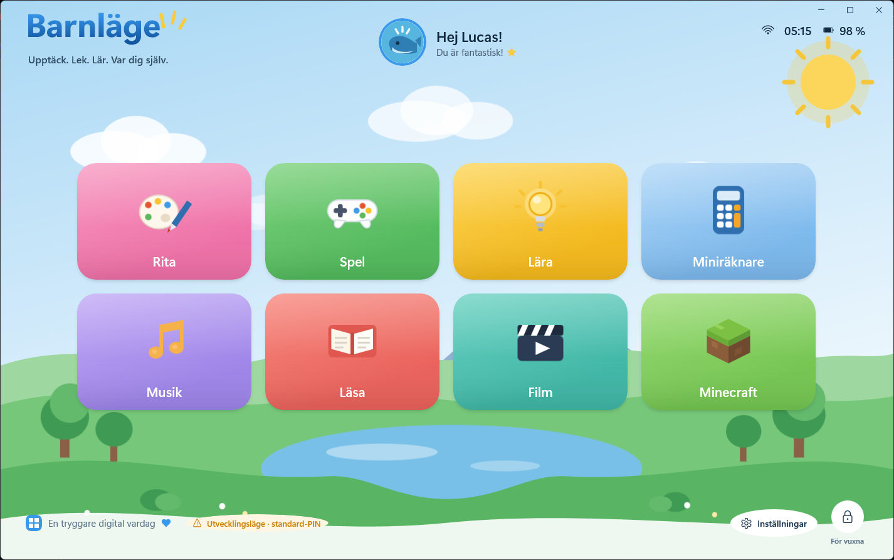
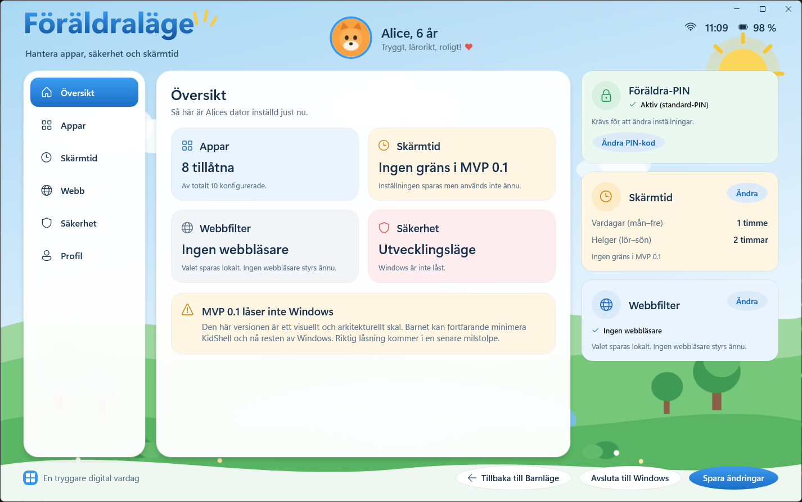
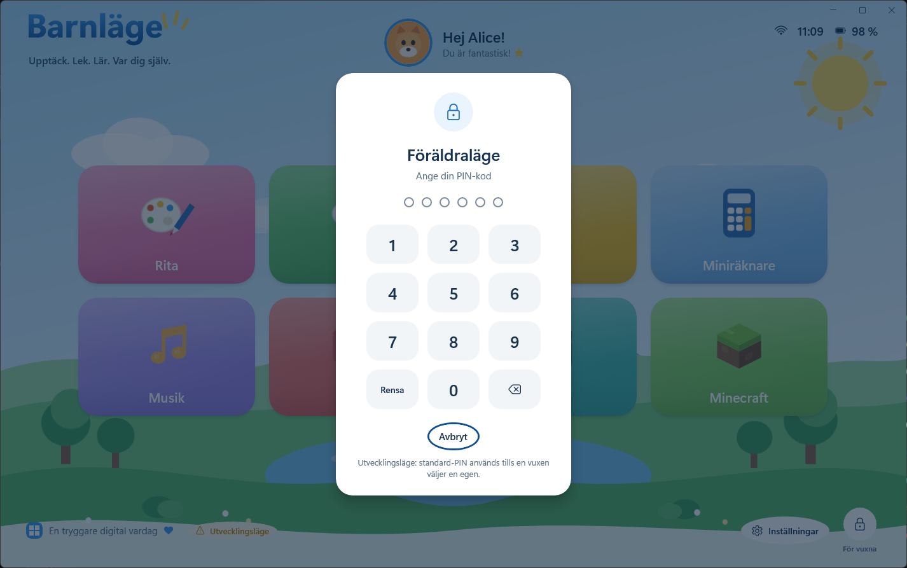
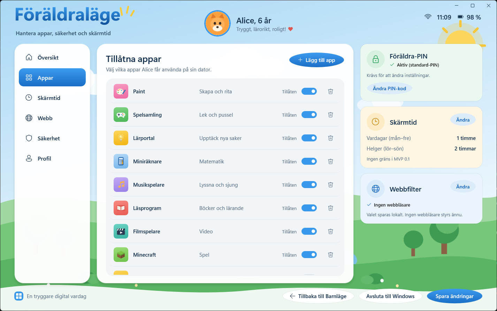

# KidShell / Barnläge

KidShell turns an ordinary Windows laptop into something a six-year-old can use
on their own. On first launch a parent runs a short setup that names the child
and chooses their avatar and theme. After that the child sees **Barnläge** — a
bright, illustrated home screen with a handful of large, obvious cards. A parent
holds one button for three seconds, enters a PIN, and gets **Föräldraläge**: a
calmer screen for deciding what the child may use.

> **Development status: MVP 0.1 — visual application shell, plus first-run
> child profile onboarding.**
>
> **WINDOWS LOCKDOWN STATUS: NOT ENABLED.**
> KidShell has not changed anything about this machine's Windows configuration
> and does not restrict the child in any way yet. See
> [What MVP 0.1 deliberately does not secure](#what-mvp-01-deliberately-does-not-secure).

---

## Screenshots

| First run | |
| --- | --- |
|  |  |
|  |  |

| Barnläge | Föräldraläge |
| --- | --- |
|  |  |
|  |  |

The approved visual direction lives in
[`docs/design/child-home-reference.png`](docs/design/child-home-reference.png)
and
[`docs/design/parent-mode-reference.png`](docs/design/parent-mode-reference.png).
Every screen in the app is built against those two images.

---

## What MVP 0.1 does

* A real, packaged WinUI 3 desktop application on .NET 10 and Windows App SDK 2.5.1.
* **First-run setup.** KidShell ships with no child configured. On first launch
  a parent walks six screens — welcome, name, avatar, age, theme, finish — and
  only the last one writes anything. There is no placeholder child and no
  pretend profile; close the window half-way and setup simply runs again.
* **Barnläge** — illustrated vector scene in one of five themes, the configured
  child profile, live clock/battery/network readout and a responsive 4x2 grid of
  large app cards with hover, pressed and keyboard-focus states.
* **Föräldraläge** — six working pages (Översikt, Appar, Skärmtid, Webb,
  Säkerhet, Profil) behind a PIN.
* **Configuration-driven app grid.** The cards come from a JSON configuration
  document, never from XAML. Toggling an app in Parent Mode and pressing
  *Spara ändringar* changes what the child sees.
* **A launcher abstraction** (`IAppLauncher`). Rita launches Paint and
  Miniräknare launches Windows Calculator through it; missing or unconfigured
  programs produce a friendly card-level message instead of a crash.
* **A parent PIN service** with PBKDF2 hashing, plus a clearly marked
  development fallback PIN.
* **Fourteen vector avatars and five scene themes** (Skogen, Rymden, Havet,
  Dinosaurier, Färgglatt), chosen during setup and editable afterwards in
  Parent Mode. Text drawn on the scene flips to a light palette on the dark
  themes so it stays readable.
* **Durable local configuration** with atomic-ish writes, a `.bak` copy and
  recovery from a corrupt file.
* **Security readiness, read-only.** Detects the real Windows edition
  (without trusting the misleading `ProductName` value), reports which
  capabilities exist, runs pre-flight checks and prints the plan a future
  secure setup would follow — while being structurally incapable of changing
  anything.
* **Local-only logging.** No telemetry, no analytics, no network calls at all.

---

## What MVP 0.1 deliberately does NOT secure

This milestone is a visual and architectural shell. It is **not** a child
lockdown product yet, and the Säkerhet page inside the app says so in the same
words:

* No Windows account is created or modified.
* Assigned Access / kiosk mode is **not** configured.
* AppLocker and WDAC are **not** configured.
* No Group Policy, registry or UAC changes are made.
* Explorer is **not** replaced; Task Manager and Windows shortcuts still work.
* No service or watchdog is installed.
* Screen-time limits are **stored but not enforced**.
* The web filter choice is **stored but changes no browser settings** and sets
  no Edge policies.
* A child can minimise or close KidShell like any other program.

If you need a locked-down machine today, KidShell is not that yet.

---

## First run and resetting it

The first time KidShell starts with no configured child, it opens **first-run
setup** instead of Child Mode:

```text
Launch
  └─ configuration has a finished child profile?
       ├─ no  → First-run setup (Välkommen till Barnläge)
       └─ yes → Barnläge
```

Routing is decided once, at startup, from the persisted configuration. It is
deterministic: `KidShellConfiguration.RequiresOnboarding` is true unless the
profile carries `isOnboardingComplete` **and** a name, an age and an avatar.
Both halves matter, so a document written half-way can never produce a
partially configured Child Mode.

Nothing is persisted until *Starta Barnläge* on the final screen. Closing the
window mid-setup leaves the configuration untouched and setup runs again next
time.

### Running setup again

Three ways, in order of preference:

1. **In the app.** Föräldraläge → **Profil** → **Kör introduktionen igen**.
   Asks for confirmation, then clears only the child's name, age and avatar and
   returns to setup. The app list, screen time, web settings and the parent PIN
   are kept — this is also how you hand the machine to a different child.

2. **Edit the configuration.** Set `isOnboardingComplete` to `false` in
   `kidshell.config.json` (path under [Where the data lives](#where-the-data-lives))
   while KidShell is closed. Clearing `name`, `age` or `avatarId` has the same
   effect.

3. **Start from nothing.** Delete `kidshell.config.json` (and the `.bak` beside
   it) while KidShell is closed. This also discards the app list and every other
   setting, so prefer option 1 or 2 unless you want genuinely fresh defaults.

```powershell
# Option 3 - full reset. KidShell must not be running.
Remove-Item "$env:LOCALAPPDATA\Packages\KidShell.Barnlage.Dev_b19zrs1eesfdc\LocalState\kidshell.config.json*"
```

### Upgrading an existing install

The configuration document is versioned. Schema 1 (MVP 0.1) had no concept of
onboarding, so it is migrated on load:

* a profile still carrying the shipped placeholder name is treated as *never
  set up* — it is cleared and setup runs;
* any other profile is carried over as an already-configured child, so
  upgrading never pushes a family back through setup;
* the old `meadow` and `sunset` theme ids become `forest` and `bright`.

Everything outside the child profile — apps, screen time, web settings, PIN —
survives the migration untouched, and the migrated document is written straight
back at schema 2.

---

## Windows requirements

KidShell's **user interface** runs on any Windows 10 or 11 machine, and can be
developed and tested without changing a single Windows setting. That is what
every 0.1.x build does.

KidShell's **security** is a different question, and depends on the edition:

| Edition | Best available mode | Why |
| --- | --- | --- |
| Windows 11 / 10 **Home** | Standard | No Assigned Access (AppLocker *enforcement* is supported) |
| Windows 11 / 10 **Pro**, Pro Education, Pro for Workstations | Secure | Assigned Access, plus the AppLocker CSP |
| **Enterprise**, **Education**, IoT Enterprise | Secure | Assigned Access, plus the AppLocker CSP |

**AppLocker is not edition-gated.** Since
[KB 5024351](https://support.microsoft.com/help/5024351), Windows 10 version
2004 and newer and all Windows 11 versions enforce AppLocker policies on every
edition, Home included. What still varies is how a policy gets *installed*: the
AppLocker CSP needs Pro or above, and the PowerShell module and policy console
are not present on every machine. A stock Home machine can therefore enforce a
policy it has no first-party way to deploy — KidShell reports that state
honestly rather than rounding it to "unavailable".

* **Standard mode** (planned): a separate standard Windows account for the
  child, KidShell's own app allowlist, AppLocker enforcement where a
  deployment route exists, UAC separation, autostart and a watchdog. The child
  can still minimise KidShell and use the rest of that account's desktop.
* **Secure mode** (planned): everything in Standard, plus Assigned Access
  restricting the child's sign-in to KidShell.

Standard is **not** equivalent to Secure, and KidShell never says it is.

> ### This build does not protect Windows
>
> **MVP 0.1.x is not parental-control security software.** It has applied no
> Windows lockdown of any kind: no accounts are created, no policy is written,
> no kiosk mode is configured, and the child can leave KidShell at any time by
> minimising it.
>
> Föräldraläge → **Säkerhet** reports exactly what this machine could support
> and what KidShell would change, and states that nothing has been changed.
> That page runs a strictly read-only scan — detection, evaluation and
> planning, and no write path exists in the code at all. See
> [`docs/architecture/SECURITY-READINESS.md`](docs/architecture/SECURITY-READINESS.md).
>
> Treat KidShell today as a friendly shell for a supervised child, not as a
> lock.

### Checking your own machine

Open Föräldraläge → Säkerhet. It shows the detected edition and build, your
account type, UAC state, which capabilities exist, and — under **Avancerat** —
the raw diagnostics plus the execution mode, which reads `AuditOnly`.

Under **Avancerat** the AppLocker surface is broken out in full: enforcement,
the Application Identity service, the PowerShell module, local policy
readability, the policy store, the management console and the CSP — because
those are separate questions with different answers on the same machine.

**Visa säkerhetsplan** prints the exact steps a future secure setup would take
on your machine. It runs none of them.

---

## Requirements

| | |
| --- | --- |
| OS | Windows 10 1809 (10.0.17763) or later; developed on Windows 11 |
| SDK | .NET SDK 10.0.300 or later (`dotnet --version`) |
| Runtime | Windows App Runtime 2.5.1 (installed automatically with Visual Studio, or from Microsoft) |
| For the CLI run script | Developer Mode enabled in Windows Settings → System → For developers |

Developer Mode is needed only so that an unsigned local package layout can be
registered. It is a setting you turn on for yourself; KidShell never changes it.

---

## How to build

```bash
dotnet build KidShell.sln -p:Platform=x64
```

Core and the test project build for any platform; the app project targets
`x64` and `ARM64`.

## How to run

The app is a packaged (MSIX) WinUI 3 application, so the loose build output has
to be registered before it can start. The repository ships a script that builds,
registers and launches in one step:

```bash
powershell -NoProfile -ExecutionPolicy Bypass -File tools\run-kidshell.ps1
```

Useful switches:

```bash
powershell -NoProfile -ExecutionPolicy Bypass -File tools\run-kidshell.ps1 -SkipBuild
```

```bash
powershell -NoProfile -ExecutionPolicy Bypass -File tools\run-kidshell.ps1 -Unregister
```

From Visual Studio, set **KidShell.App** as the startup project and press F5 —
the normal packaged-app F5 loop works as usual.

## How to run the tests

```bash
dotnet test tests\KidShell.Core.Tests\KidShell.Core.Tests.csproj
```

---

## ⚠️ Development PIN

Until a parent sets their own PIN, Parent Mode accepts the built-in
development PIN:

```text
246810
```

This is **development only**:

* it is a compiled-in constant in `KidShell.Core/Security/DevelopmentPin.cs`,
* it is never written to the configuration file,
* it is only accepted while `DeveloperOptions.DeveloperMode` is `true`,
* the PIN screen and the Säkerhet page both say out loud that it is in use.

Shipping to real families requires removing the fallback and forcing PIN setup
during first run. That is tracked for the Windows integration milestone.

While `DeveloperMode` is true there is also a keyboard shortcut,
**Ctrl+Shift+P**, that opens the PIN prompt without the three-second hold, so
development is never blocked by the gesture.

---

## Architecture overview

```text
KidShell.App  (WinUI 3, net10.0-windows)   views, view models, design system
      │
      ▼
KidShell.Core (net10.0, no UI)             configuration, launching, PIN, logging
      ▲
      │
KidShell.Core.Tests (xunit)                68 tests, no UI and no real processes
```

* **KidShell.Core** deliberately has no Windows TFM and no WinUI reference, so
  everything important is testable without a window.
* **`IAppStateService`** is the single source of truth. Child Mode reads the
  live configuration; Parent Mode edits a detached clone and only `Commit`
  makes it real.
* **`IAppLauncher`** is the only route to another program. No view or view
  model calls `Process.Start`.
* **`IParentPinService`** hides how PINs are stored so the file-based
  implementation can be swapped for Credential Manager or Hello later.

Full detail: [`docs/architecture/MVP-0.1.md`](docs/architecture/MVP-0.1.md).

---

## Where the data lives

| | |
| --- | --- |
| Configuration | `%LOCALAPPDATA%\Packages\KidShell.Barnlage.Dev_…\LocalState\kidshell.config.json` |
| Backup | the same path with `.bak` |
| Log | `…\LocalState\logs\kidshell.log` |

Nothing is written to Program Files, and nothing leaves the machine. The exact
paths for the current install are shown on the Säkerhet page inside the app.

KidShell does not collect keystrokes, document contents, browsing contents,
passwords or chats, and has no cloud component.

---

## Assets

Every image and icon in this repository is generated or drawn for the project.
See [`assets/README.md`](assets/README.md) for provenance and licensing.

---

## Roadmap

| Version | Scope | Status |
| --- | --- | --- |
| 0.1 | Application shell | ✅ done |
| 0.1.1 | First-run onboarding | ✅ done |
| 0.1.5 | Security readiness (dry run) | ✅ done |
| **0.2** | **Product UX, production PIN, app discovery** | **in progress** |
| 0.3 | Transactional Windows integration foundation | planned |
| 0.4 | Child account + application control preparation | planned |
| 0.5 | Screen time, web, watchdog | planned |
| 0.6 | Installer, updater, deployment | planned |
| 0.7 | Hardening and escape testing | planned |
| 0.8 | Release candidate preparation | planned |
| 1.0 | Production release | blocked on dedicated-device validation |

Scope, principles and the out-of-scope list live in
**[`docs/ROADMAP.md`](docs/ROADMAP.md)**, which is authoritative.

### Documentation

| | |
| --- | --- |
| [`docs/ROADMAP.md`](docs/ROADMAP.md) | Version progression, principles, out of scope |
| [`docs/SECURITY.md`](docs/SECURITY.md) | Threat model, what is actually in force, escape-test matrix |
| [`docs/PRIVACY.md`](docs/PRIVACY.md) | Every file written, and what is never collected |
| [`docs/RECOVERY.md`](docs/RECOVERY.md) | Getting back in when something goes wrong |
| [`docs/TESTING.md`](docs/TESTING.md) | How the suite is organised and what it does not cover |
| [`docs/DEPLOYMENT.md`](docs/DEPLOYMENT.md) | Packaging, signing boundary, update rules |
| [`docs/architecture/`](docs/architecture/) | Milestone architecture notes |

Milestones 0.3 and later are the ones that will eventually change a machine.
None of them has, and none of them will on a development machine.

---

## Licence

Copyright © 2026 Jimmy Eliasson. All rights reserved.

KidShell is proprietary software. No permission is granted to copy, modify, distribute, sublicense, sell, publish, or create derivative works from the software except with prior written permission from the copyright holder. See [LICENSE](LICENSE).
